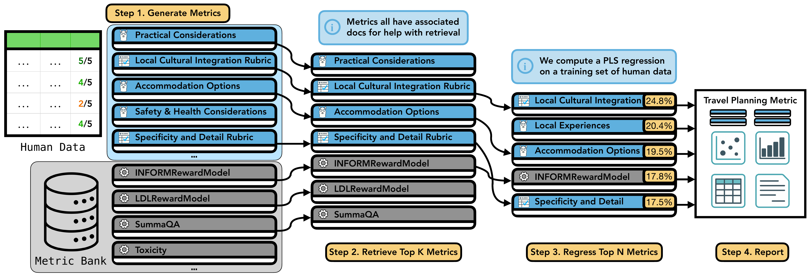

# AutoMetrics

**Automatically induce evaluation metrics that approximate human judgment from fewer than 100 labels.**

[](https://pypi.org/project/autometrics-ai/)
[](https://www.python.org/)
[](LICENSE)
[](https://openreview.net/forum?id=ymJuBifPUy)

AutoMetrics takes a small set of human-labeled examples (thumbs, Likert, pairwise — under 100 points) and produces a single interpretable evaluator for your task. It synthesizes candidate criteria with LLM judges, retrieves complementary metrics from a curated bank of 48, and composes them with PLS regression. Across five tasks in the paper, it beats LLM-as-a-judge baselines by up to **+33.4% Kendall τ**, and in an agentic-task case study it matches the performance of a verifiable reward.



---

## Install

```bash
pip install autometrics-ai
```

Base install requires only Python 3.9+. Heavy dependencies (Java 21, `pyserini`, `pylate`, `bert_score`, …) are loaded lazily — they're needed only if you opt into features that use them.

## Quickstart

```bash
export OPENAI_API_KEY="sk-..."
python examples/tutorial.py
```

Builds a tiny custom dataset, generates a handful of LLM-judge metrics for your task, fits PLS to your human scores, and writes an interactive HTML report to `artifacts/`. No Java, no GPU, no bank dependencies required for this path.

## How it works

1. **Generate.** Propose task-specific candidate metrics — single-criterion, rubric, example-based, and MIPROv2-optimized LLM judges (10 + 5 + 1 + 1 by default).
2. **Retrieve.** Rank the generated candidates alongside the 48-metric **MetricBank** (ColBERT → LLM reranker) and keep the top `k=30`.
3. **Regress.** Fit Partial Least Squares on the training set to select `n=5` predictive metrics and learn their weights.
4. **Report.** Emit (a) the aggregated metric as a Python class you can import, (b) a Metric Card per generated metric, and (c) an HTML report card with coefficients, correlation, robustness, runtime, and per-example feedback.

For datasets of ≤100 rows AutoMetrics runs in **generated-only mode** by default, skipping the metric bank entirely.

See the paper ([ICLR 2026](https://openreview.net/forum?id=ymJuBifPUy)) for the full method, ablations, and case study.

## Examples

| File | Scope | Requires |
|---|---|---|
| [`examples/tutorial.py`](examples/tutorial.py) | Dead-simple 8-row demo, generated-only | `OPENAI_API_KEY` |
| [`examples/autometrics_simple_example.py`](examples/autometrics_simple_example.py) | Full pipeline with defaults on HelpSteer | + Java 21, bank extras |
| [`examples/autometrics_example.py`](examples/autometrics_example.py) | Custom generators, retriever, regressor, priors | + your own config |

Narrative walkthrough: [`examples/TUTORIAL.md`](examples/TUTORIAL.md).

## Use on your own data

```python
import dspy, pandas as pd
from autometrics.autometrics import Autometrics
from autometrics.dataset.Dataset import Dataset

df = pd.DataFrame({
    "id": ["1", "2", "3"],
    "input":  ["prompt 1", "prompt 2", "prompt 3"],
    "output": ["response 1", "response 2", "response 3"],
    "score":  [4.5, 3.2, 4.8],
})
dataset = Dataset(
    dataframe=df, name="MyTask",
    data_id_column="id", input_column="input", output_column="output",
    target_columns=["score"], ignore_columns=["id"], metric_columns=[],
    reference_columns=[], task_description="Describe your task in one sentence.",
)

llm = dspy.LM("openai/gpt-4o-mini")
results = Autometrics().run(
    dataset=dataset, target_measure="score",
    generator_llm=llm, judge_llm=llm,
)

final = results["regression_metric"]       # an importable Metric
final.predict(dataset)                     # scores on any Dataset with same schema
```

## Requirements

| Component | Needed for |
|---|---|
| Python ≥ 3.9 | everything |
| `OPENAI_API_KEY` (or any LiteLLM-compatible endpoint) | LLM-based generation and judging |
| Java 21 | BM25 retrieval over the full MetricBank (`pyserini`) |
| GPU | some bank metrics (reward models, large BERTScore); CPU works for generated-only |

## Repository layout

```
autometrics/
├── autometrics.py            Pipeline orchestrator
├── dataset/                  Dataset interface + built-in tasks
├── metrics/                  MetricBank (48 metrics) + generated metric scaffolds
├── generator/                LLM judge proposers (single, rubric, examples, G-Eval, optimized)
├── recommend/                Retrievers (BM25, ColBERT, LLMRec, Pipelined)
├── aggregator/regression/    PLS (default), Lasso, Ridge, ElasticNet, HotellingPLS
└── util/report_card.py       HTML report generator
examples/                     Tutorial scripts and walkthroughs
```

## Optional extras

<details>
<summary>Install extras for metric-bank components with heavier dependencies</summary>

```bash
pip install "autometrics-ai[bert-score,rouge,bleurt]"
pip install "autometrics-ai[reward-models,gpu]"
pip install "autometrics-ai[mauve,parascore,lens,fasttext]"
```

Individual clusters: `fasttext`, `lens`, `parascore`, `bert-score`, `bleurt`, `moverscore`, `rouge`, `meteor`, `infolm`, `mauve`, `spacy`, `hf-evaluate`, `reward-models`, `readability`, `gpu`. See `pyproject.toml` for the full mapping. Metrics whose dependencies are missing are silently skipped with a warning — no install is strictly required.

</details>

## Citation

```bibtex
@inproceedings{ryan2026autometrics,
  title   = {AutoMetrics: Approximate Human Judgments with Automatically Generated Evaluators},
  author  = {Ryan, Michael J and Zhang, Yanzhe and Salunkhe, Amol and Chu, Yi and Xu, Di and Yang, Diyi},
  booktitle = {The Fourteenth International Conference on Learning Representations},
  year    = {2026},
  url     = {https://openreview.net/forum?id=ymJuBifPUy}
}
```

## License

MIT — see [LICENSE](LICENSE).
